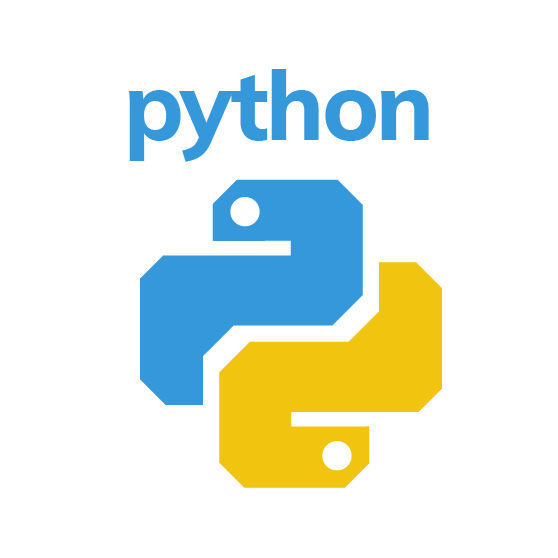

[Matous Holinka](https://www.linkedin.com/in/matous-holinka/) | <bralor92@email.cz> | [go to Engeto -->](https://engeto.com/) | [install python -->](https://docs.python.org/3/using/index.html)



# Goodies:
Useful links/ uzitecne odkazy:
- [large typing](https://large-type.com/#*hello*)
- [chat](https://tlk.io/)
- [slack](https://slack.com/intl/en-cz/)

# Why Python?
[Article](https://dev.to/j_marathi/why-you-should-learn-python-in-2020-243d)

# Python community
[FAQ](https://dev.to/j_marathi/why-you-should-learn-python-in-2020-243d)

# Python academy 2020
#### EN
This course focuses on the basics of the Python programming language. The goal is to learn to think like a programmer. Understand the basics and some of the more advanced features in Python.

#### CZ
Tento kurz je zamereny na seznameni se zaklady v programovacim jazyce Python. Cilem je naucit se myslet jako programator. Pochopit zaklady a nektere pokrocilejsi prvky v Pythonu.

# Introduction
Opening presentation/ Uvodni prezentace -->
[link](https://docs.google.com/presentation/d/1rz0A46HDcbyAdZMLucDNtpOg1RgB-Y_FIhyeHceTfm4/edit#slide=id.p)

# First project
#### EN
Simple Python script named "Destinatio"

#### CZ
Jednoduchy skript pro Python pojmenovany "Destinatio"

# Milestones
#### CZ
```
#!/usr/bin/env python3
""" Lekce #1 - Uvod do programovani, 1/2 Destinatio """

# I. KROK: 
# Definujeme promenne, se kterymi chceme pracovat

# II. KROK:
# Pozdravime uzivatele, oddelime text
# Zobrazit uzivateli nasi nabidkou - cislo - lokalita | cena

# III. KROK:
# Vyzadame si od uzivatele jednotlive vstupy
# cislo destinace, jmeno, prijmeni, vek, email, heslo

# IV. KROK:
# Modifikujeme tyto hodnoty

# VI. KROK:
# Vystupni sekce, vypisujeme konkretni udaje
# Jmeno, destinaci, cenu, email
```
# Prerequisites
## Integers
#### EN
We write values using integers

```
# using Python interpret
>>> type(1100)
<class 'int'>
>>> 1100 + 100
1200
```

#### CZ
Hodnoty zapisujeme pomoci celych cisel

```
# zapis pomoci Python interpretru
>>> type(1100)
<class 'int'>
>>> 1100 + 100
1200
```

## Floats
#### EN
We write values as decimal number. The separator is dot! Decimal point is used for other purposes.

```
>>> type(3.1415926536)
>>> 10/3; type(10/3)
3.3333333333333335
<class 'float'>
```

#### CZ
Hodnoty zapisujeme jako desetinna cisla. Oddelovac je tecka! Carka slouzi k jinym ucelum.

```
>>> type(3.1415926536)
>>> 10/3; type(10/3)
3.3333333333333335
<class 'float'>
```

## Operations
#### EN
In Python we use basic mathematical operations. That is addition, subtraction, multiplication and division. We also have three other operations: floor division, modulo, negation and power.

#### CZ
V Pythonu pouzivame zakladni matematicke operace. Tedy scitani, odcitani, nasobeni a deleni. Dale mame tri dalsi operace: celociselne deleni, modulo, negace a umocnovani.

```
>>> num1 = 5
>>> num2 = 4
>>> num1 + num2
9
>>> num1 - num2
1
>>> num1 * num2
20
>>> num1 / num2
1.25
>>> num1 // num2
1
>>> num1 % num2
1
>>> -num1
-5
>>> num1 ** num2
625
```

## Strings
#### EN
These are various long groupings of characters (numbers, letters, special symbols, ..), enclosed in quotation marks.

#### CZ
Jde o ruzne dlouhe uskupeni znaku (cisla, pismena, specialni symboly,..), ohranicenych uvozovkami.

```
>>> "Matous Holinka"; type("Matous Holinka")
'Matous Holinka'
<class 'str'>
>>> '1234566789'; type('1234566789')
'1234566789'
<class 'str'>
>>> "!@#$%%^&*"; type("!@#$%%^&*")
'!@#$%%^&*'
<class 'str'>
```

## Variables / promenne
#### EN
Variables in Python are just symbolic names that are pointers to an object in physical memory.

<variable_name> = <value> (string, integer, float)
```
city = 'Prague' # string
count = 2       # integer
price = 1000.5  # float
```

#### CZ
Promenne v Pythonu jsou je symbolickymi odkazy, ktere odkazuji na objekt v pameti.

<jmeno_promenne> = <hodnota> (retezec, cele_cislo, desetinne_cislo)
```
mesto = 'Praha' # retezec
mnozstvi = 2    # cele_cislo
cena = 1000.5   # desetinne_cislo
```

## List/tuple
#### EN
A list is a mutable element sequence. The individual elements can be changed, we can work with any part of the list, we can extend or delete it.

A tuple, on the other hand, is an immutable sequence of elements. Although we can use individual data, we cannot change it.

#### CZ
List neboli seznam je zmenitelna posloupnost prvku. Tzn. jednotlive prvku muzeme menit, muzeme pracovat s libovolnou casti seznamu, muzeme jej rozsirovat nebo promazavat.

Tuple neboli n-tice je naopak nezmenitelna posloupnost prvku. Muzeme sice pouzivat jednotlive data, ale nemuzeme je menit.

```
>>> names = ["Matous", "Marek", "Lukas", "Jan"]; type(names)  # list of strings
<class 'list'>
numbers = ("11", 11, "eleven"); type(numbers)  # list of strings
<class 'tuple'>
```

## print()
#### EN
It's a built-in Python feature (installed with Python, we don't have to create one). The purpose of this function is to list the information that we put in the round tabs.

#### CZ
Je to vestavena funkce Pythonu (s Pythonem nainstalovana, neni nutne ji tvorit). Ucelem teto funkce je vypsat informace, ktere ji vlozime do kulatych zavorek.

```
>>> print("Matous")
Matous
>>> name = 'Matous'; print(name)
Matous
```
## input()
#### EN
This is again a built-in function in Python. This function expects some input information from the user.

#### CZ
Jde opet o vestavenou funkci v Pythonu. Tato funkce ocekava od uzivatele nejakou vstupni informaci.

```
>>> email = input("Your email address: "); print(email)  # matous@nic.cz
matous@nic.cz
```
